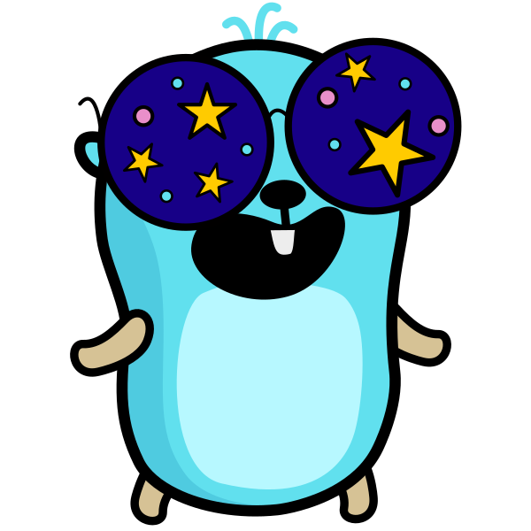

  

`gomod-lens` explores public Go module dependency graphs in a browser. It can
run as a Go web server or as a static WebAssembly build, and analyzes modules
through composable lenses. Built-in lenses currently cover OpenSSF Scorecard
data from deps.dev and release freshness from the Go module mirror.

## Lenses

Lenses attach focused analysis results to each module in the graph. OpenSSF
Scorecard highlights security and supply-chain health, while Release Freshness
shows whether selected versions are current, patch/minor/major behind,
pre-release, pseudo-version, or unknown. The graph model carries both lens
metadata and per-node lens results so contributors can add more lenses over time.

## Development

Run `make help` for the full target list.

See [CONTRIBUTING.md](CONTRIBUTING.md) for development notes.

## Privacy

Treat go.mod Lens as a public-module explorer. Do not submit private module
paths, repository names, tokens, or other secrets to a public deployment.
External service behavior is summarized in [PRIVACY.md](PRIVACY.md).

## Credits

Mascot artwork uses
[63.svg](https://github.com/MariaLetta/free-gophers-pack/blob/master/characters/svg/63.svg)
from [MariaLetta/free-gophers-pack](https://github.com/MariaLetta/free-gophers-pack),
licensed under CC0 1.0 Universal.

## License

go.mod Lens is released under the MIT License. See [LICENSE](LICENSE).

Third-party notices are in [THIRD_PARTY_NOTICES.md](THIRD_PARTY_NOTICES.md).
